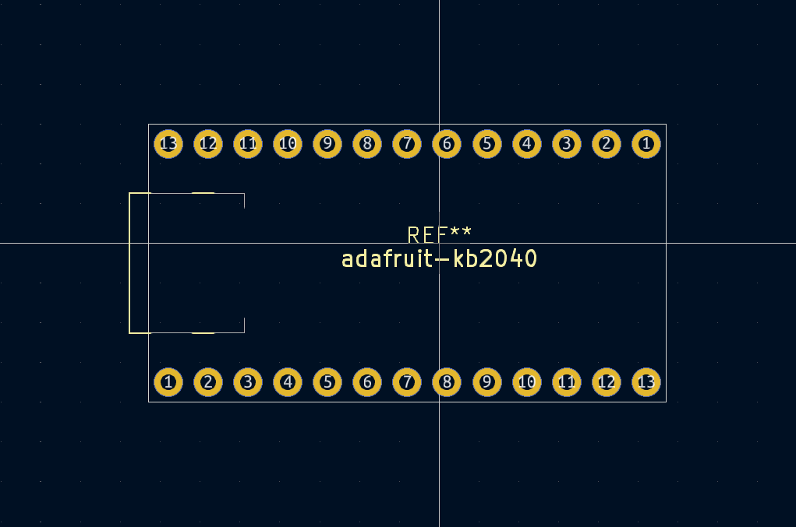
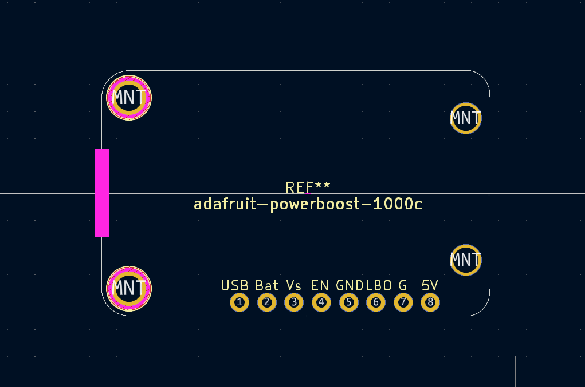
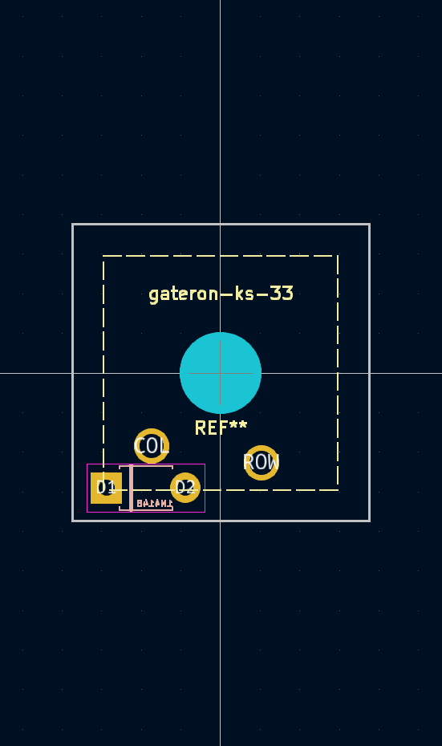
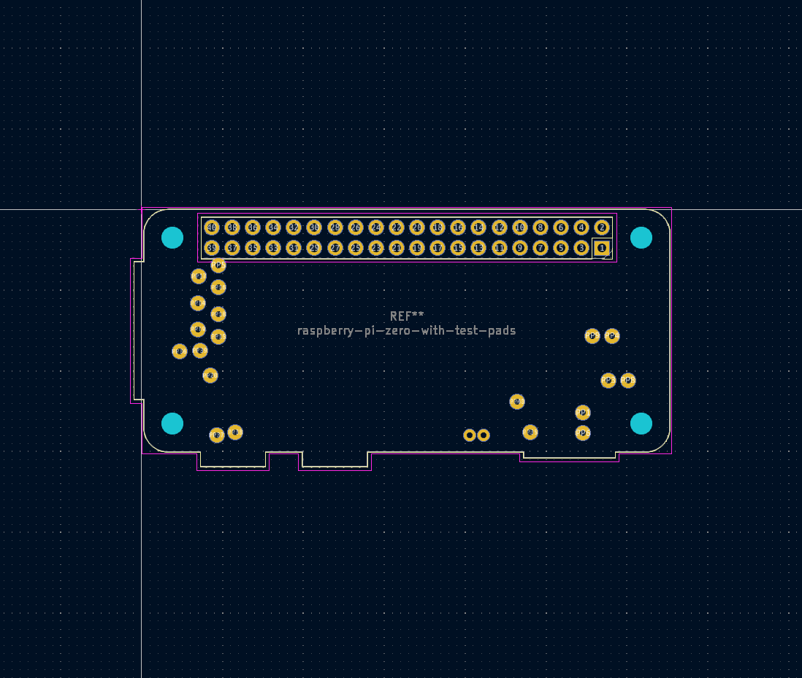
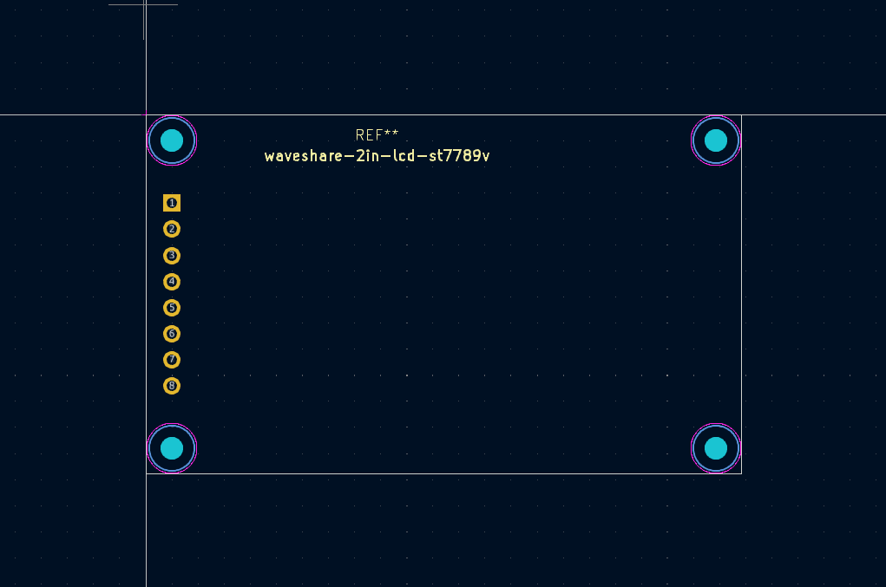

## openwrite.pretty

Custom and modified KiCAD footprints used to build the openwrite PCB.

### adafruit-kb2040

### adafruit-powerboost-1000c

### gateron-ks-33-diode

### raspberry-pi-zero-with-test-pads

### waveshare-2in-lcd-st7789v

